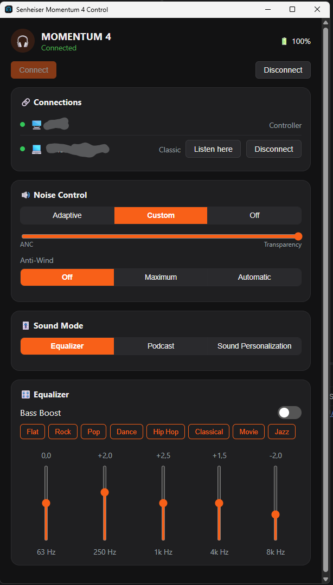

# SenheiserMomentum4

An unofficial Windows tray app for the Sennheiser MOMENTUM 4 Wireless headphones. It talks to the headset directly over its Bluetooth RFCOMM control channel using the same GAIA-based protocol the official mobile app uses, so you get ANC, EQ, and multipoint control on the desktop without an Android emulator.

Not affiliated with or endorsed by Sennheiser. The protocol was reverse-engineered by the community (see [Acknowledgments](#acknowledgments)) and may break on firmware updates.

## Features

- **Tray-resident**: connects automatically on launch and reconnects if the link drops, no window required.
- **Noise control**: Adaptive ANC, Custom ANC with a transparency slider, or Off.
- **Anti-wind mode**: Off / Maximum / Automatic.
- **Sound mode**: Equalizer / Podcast / Sound Personalization.
- **Graphic EQ**: per-band gain sliders (5 or 10 bands, depending on firmware) plus quick presets, and a Bass Boost toggle.
- **Battery level**.
- **Multipoint device list**: see paired devices, switch which one the headset is listening to, connect/disconnect.
- **Start with Windows** toggle from the tray menu.

## Screenshots



## Requirements

- Windows 10 build 19041+ / Windows 11 (WebView2 runtime, usually already present).
- .NET 10 runtime.
- A MOMENTUM 4 Wireless already paired via Windows Bluetooth settings — this app opens the paired RFCOMM service, it does not perform pairing itself.

## Building

```
dotnet build SenheiserControl.sln
```

Run `SenheiserControl` (WinExe, tray app — no console window). On first launch it searches for the paired headset and connects automatically.

## How it works

The app is a Blazor Hybrid WinForms host: a `NotifyIcon` tray shell hosting a WebView2-rendered Razor UI (`SenheiserControl/Components/Main.razor`), backed by `HeadsetService`, which owns the RFCOMM socket and speaks GAIA-v3 frames (`FF 03` magic, length, Sennheiser vendor ID `0x0495`, command, payload; responses echo the command with the `0x0100` bit set). See `NOTES.md` for the full protocol write-up and command table.

## Acknowledgments

Protocol details were confirmed against these MIT-licensed community projects, without which this wouldn't exist:

- [f3Y0/momentum4-control](https://github.com/f3Y0/momentum4-control)
- [jarek102/ohr](https://github.com/jarek102/ohr)
- [Zhengyang-Liu/m4-companion](https://github.com/Zhengyang-Liu/m4-companion) — ANC sub-modes, sound mode, and EQ payload formats; the tray/app icon is also from this project

## License

[MIT](LICENSE)
